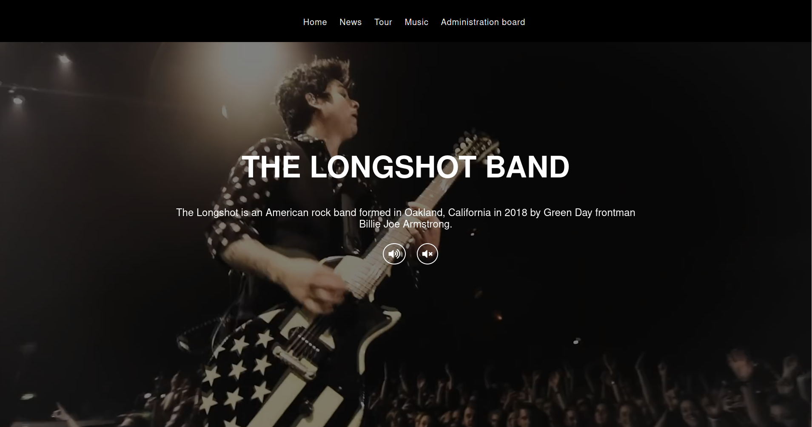
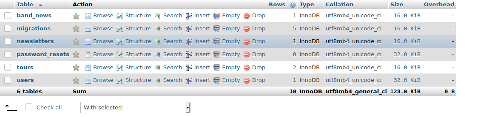
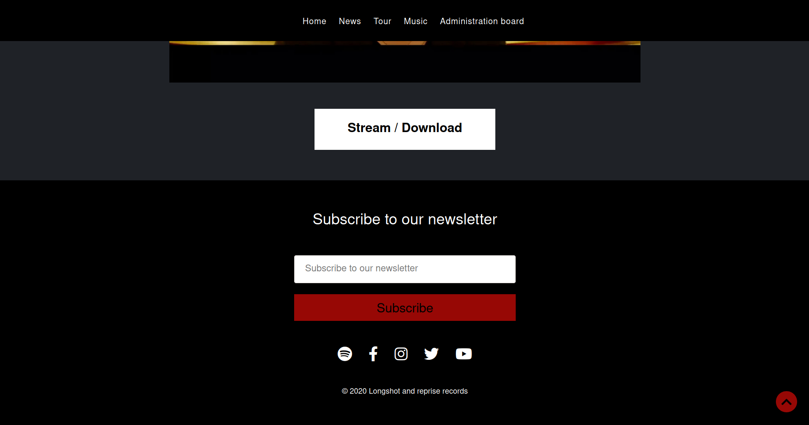
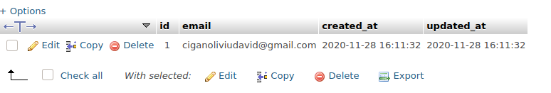
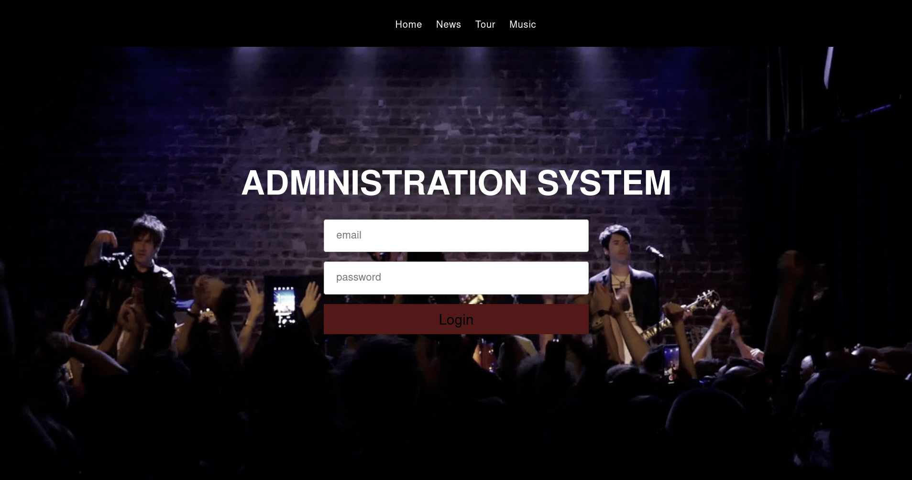
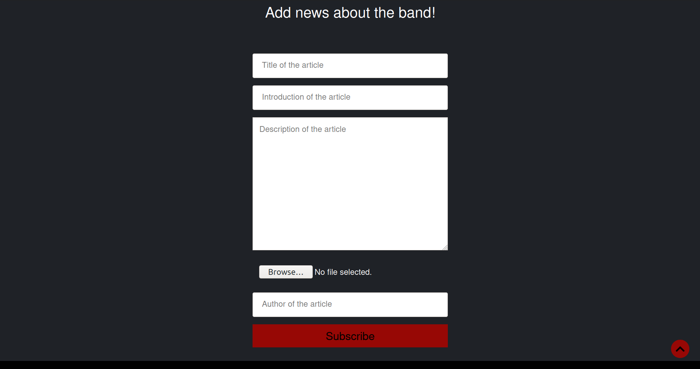
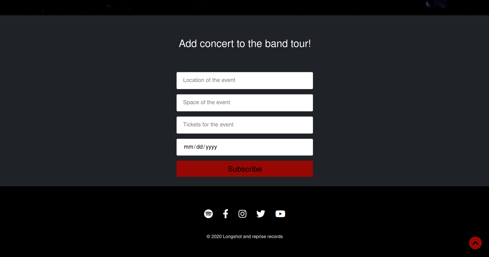
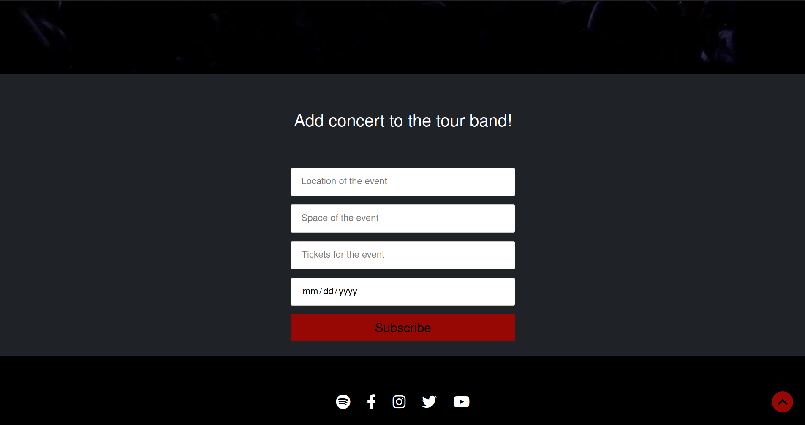

# Longshot

This app represents the presentation website for a band called longshot.

## Backend

This app contains different subsystems such as a newsletter, an administration
board and others. The database behind the system is mysql.

##### Newsletter

The science behind is simple, the user has a form in the webapp where he can either send his email or ignore
the form. If the data is send, it will be saved automatically in a table called newsletter from mysql.

##### How the form looks for the user

##### How the stored data looks in mysql

##### Administration Board with tours and news

The Administration board represents a login system, an admin account will be created for the 
future administrator by the developer. With that account the administrator will have access on a web 
page where he can add news about the band or future concerts.

##### How does the administration system form looks

As I said, the administrator will be able to either add a new concert in a tour or add news about the band
using predefined forms.

##### How does the form for adding news looks

##### How does the form for adding concerts looks

The data added in those forms is later listed in two different sections, news and tours. For the data
to be listed it has to be stored, so after sending the form the data is stored in two different tables, 
tours and news.

##### How does the data for news looks in the UI

